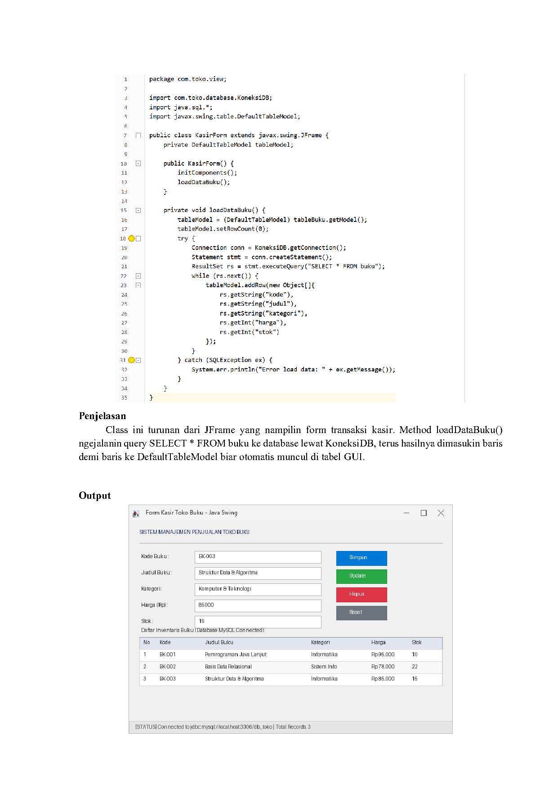
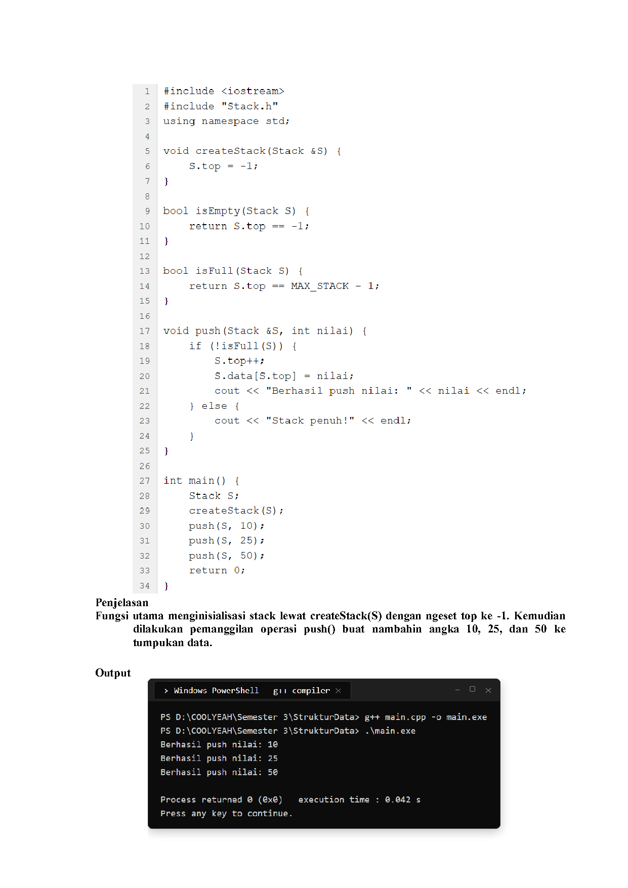

# NgeLaprak 🎓⚡
> **Universal AI Agent Skill & Generator Laporan Praktikum (Laprak)**  
> Otomatisasi penyusunan Laporan Praktikum lintas mata kuliah teknik/informatika ke dalam format **Microsoft Word (`.docx`)** dan **PDF (`.pdf`)** dengan tangkapan layar IDE otentik dan gaya penjelasan natural mahasiswa.

---

## 🚀 Mengapa NgeLaprak?

Seringkali saat menyuruh AI membuat laporan praktikum, hasilnya:
1. Terlihat **sangat kaku dan robotik** ("bahasa AI banget").
2. Tangkapan layar kode menggunakan kartu web palsu yang langsung ketahuan dosen/asisten.
3. Format dokumen berantakan, font tidak seragam, dan tata letak cover salah.

**NgeLaprak** dirancang khusus untuk memecahkan masalah ini. Dengan skill ini, AI Agent (seperti Google Antigravity, Claude Code, Cursor, Copilot) dapat membaca referensi modul dan template kampus Anda, lalu menghasilkan laprak siap kumpul yang **100% otentik**.

---

## ✨ Fitur Unggulan

### 1. 🌐 Universal untuk Semua Mata Kuliah
Dapat digunakan untuk berbagai mata kuliah pemrograman dan informatika:
* **ADPL & Pemrograman Berorientasi Objek (PBO)**: Java, Maven, Ant, Swing GUI, MySQL JDBC.
* **Struktur Data & Algoritma**: C++, Pointer, Struct, Linked List, Stack, Queue, Tree.
* **Basis Data**: SQL query, DDL/DML, Relasi tabel, ERD.
* **Pemrograman Web & Mobile**: JavaScript, HTML/CSS, React, Flutter, Python.
* **Sistem Operasi & Jaringan**: Bash terminal, packet tracing, Linux commands.

### 2. 📸 Engine Screenshot IDE Otentik (Mode Hybrid)
* **Apache NetBeans (Java)**:
  * String literal hijau (`#008000`), member variable ungu miring (`#990066`).
  * Highlight baris kursor aktif krem pastel (`#fff9e6`).
  * Gutter dengan ikon lampu warning hint dan garis penutup blok kurung kurawal.
  * Pemandu margin kolom pink di sisi kanan.
* **Code::Blocks (C/C++)**:
  * Tampilan font monospace dan penomoran baris khas Code::Blocks.
* **VS Code & Windows Terminal**:
  * Dark+ / Light+ theme yang bersih dan konsol native Windows 11 / MySQL client.
* **Slot Screenshot Manual**:
  * Jika mahasiswa sudah mengambil screenshot sendiri dengan *Snipping Tool*, AI akan otomatis memprioritaskan screenshot asli tersebut.

### 3. ✍️ Gaya Penulisan Natural Mahasiswa (Anti-AI Cringe)
* Penjelasan singkat, padat, dan langsung menjelaskan fungsi teknis kode (*to the point*).
* Menghindari kalimat klise AI yang berlebihan.
* Menggunakan kosakata khas mahasiswa santai dan realistis.

### 4. 📄 Output Ganda (.docx & .pdf)
* Menghasilkan dokumen Word (`.docx`) dengan margin, font, dan cover yang identik dengan template kampus.
* Ekspor otomatis ke `.pdf` siap cetak/kumpul.

### 5. 🧠 Smart Context & Auto-Scaffold (Zero-Setup Workspace)
* **File Tercecer? Nggak Masalah!**: Cukup taruh berkas materi, TP, atau laprak lama di satu folder tanpa subfolder. `NgeLaprak` otomatis membuat struktur direktori (`Modul/`, `Laprak/`, `Code/`) dan memindahkan setiap berkas ke folder yang sesuai.
* **Deteksi Mandiri Tanpa Repot**: AI secara otomatis mengenali mata kuliah, modul target, identitas mahasiswa (Nama & NIM) dari riwayat laprak lama, bahasa kodingan, hingga IDE yang cocok.

---

## 📂 Contoh Hasil Laporan Praktikum (Sample Outputs)

Repositori ini menyertakan contoh lengkap laporan praktikum yang dihasilkan oleh **NgeLaprak**:

| Mata Kuliah | Target IDE | Dokumen Word & PDF |
| :--- | :--- | :--- |
| **ADPL / PBO (Java)** | Apache NetBeans & Java Swing GUI | [`examples/adpl_modul4_sample/`](examples/adpl_modul4_sample/) <br> • [Download DOCX](examples/adpl_modul4_sample/LAPRAK_SAMPLE_ADPL_MODUL4.docx) <br> • [Download PDF](examples/adpl_modul4_sample/LAPRAK_SAMPLE_ADPL_MODUL4.pdf) |
| **Struktur Data (C++)** | Code::Blocks & Windows Console | [`examples/strukdat_modul3_sample/`](examples/strukdat_modul3_sample/) <br> • [Download DOCX](examples/strukdat_modul3_sample/LAPRAK_SAMPLE_STRUKDAT_MODUL3.docx) <br> • [Download PDF](examples/strukdat_modul3_sample/LAPRAK_SAMPLE_STRUKDAT_MODUL3.pdf) |

### 🖼️ Cuplikan Halaman Laporan

| ADPL / PBO (Java NetBeans & GUI) | Struktur Data (C++ Code::Blocks) |
| :---: | :---: |
|  |  |

---

## 📥 Cara Instalasi (Sangat Mudah)

### ⭐ Opsi 1: Lewat `npx skills` (Paling Praktis untuk AI Coding Agent)
Bagi pengguna **Antigravity, Cursor, Claude Code, Cline, Codex, Amp**, cukup jalankan satu perintah:

```bash
# Pasang ke proyek saat ini
npx skills add SatriaBaktiWijaya/NgeLaprak

# ATAU pasang secara global ke semua proyek
npx skills add SatriaBaktiWijaya/NgeLaprak -g
```
*Skills CLI akan otomatis mendeteksi AI Agent yang terpasang dan mengkonfigurasi skill tanpa perlu copy manual.*

---

### 📦 Opsi 2: Lewat `npx ngelaprak`
Bisa langsung dijalankan dari terminal:
```bash
npx ngelaprak install
```

---

### 🖥️ Opsi 3: Windows (PowerShell) - 1 Klik
Cukup clone dan jalankan skrip installer:
```powershell
git clone https://github.com/SatriaBaktiWijaya/NgeLaprak.git
cd NgeLaprak
.\install.ps1
```
Skrip ini akan otomatis memasang dependensi Python (`python-docx`, `pillow`) dan mendaftarkan skill ke direktori agen global (`~/.gemini/config/skills/ngelaprak`).

---

### 🐧 Opsi 4: Linux / macOS
```bash
git clone https://github.com/SatriaBaktiWijaya/NgeLaprak.git
cd NgeLaprak
chmod +x install.sh
./install.sh
```

---

## 💡 Cara Penggunaan dengan AI Agent

Setelah skill terpasang, kamu cukup membuka AI Agent favoritmu di folder mata kuliah dan memberikan instruksi seperti biasa:

```text
"Tolong kerjain laprak modul 4. Modul ada di folder Modul, contoh/template 
ada di folder Laprak, dan projek kodingannya ada di folder Code. Tolong buatkan 
sampai jadi Word (.docx) dan PDF-nya."
```

AI Agent akan otomatis:
1. Membaca materi dan tugas di modul.
2. Membaca format cover, nama, NIM, asisten, dan font dari template/laprak lama.
3. Menjalankan dan memverifikasi kodingan projek.
4. Menghasilkan screenshot IDE (NetBeans/CodeBlocks/VS Code) atau mengambil file yang kamu sediakan.
5. Menyusun penjelasan ringkas berbahasa mahasiswa.
6. Menyimpan dokumen `.docx` dan `.pdf` yang rapi dan terstruktur.

---

## 🛠️ CLI Mandiri (Opsional)

Jika ingin menggunakan tool mandiri lewat terminal:
```bash
# Auto-scaffold dan rapikan file tercecer ke Modul/, Laprak/, dan Code/
python -m ngelaprak organize

# Deteksi otomatis konteks modul, mahasiswa, bahasa & IDE
python -m ngelaprak analyze

# Inisialisasi struktur folder laporan di direktori kerja
python -m ngelaprak init

# Render screenshot kode IDE
python -m ngelaprak render --ide netbeans --file ./src/Main.java --out ./shot.png

# Ekspor Word ke PDF
python -m ngelaprak export-pdf --docx ./Laprak.docx
```

---

## 📂 Struktur Repositori

```
NgeLaprak/
├── SKILL.md              # Spesifikasi lengkap instruksi AI Agent
├── install.ps1           # Skrip instalasi Windows
├── install.sh            # Skrip instalasi Linux/macOS
├── package.json          # Runner npm / npx
├── ngelaprak/            # Paket Python Core
│   ├── cli.py            # Terminal interface
│   ├── core/             # Analyzer, docx builder, pdf exporter
│   └── renderers/        # NetBeans, Code::Blocks, VS Code, GUI Framer
└── templates/            # Aset tema, ikon Java, dan layout cover
```

---

## 👤 Pembuat
Dibuat oleh **Satria Bakti Wijaya**  
Telkom University Purwokerto  
GitHub: [https://github.com/SatriaBaktiWijaya/NgeLaprak](https://github.com/SatriaBaktiWijaya/NgeLaprak)
