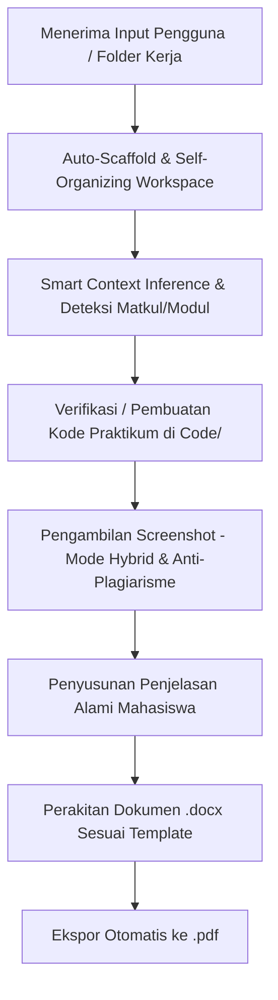

# NgeLaprak: Universal Laboratory Report Generator Skill

Skill ini memandu AI Agent dalam menyusun **Laporan Praktikum (Laprak)** yang rapi, profesional, dan otentik untuk berbagai mata kuliah teknik/informatika (seperti Struktur Data, ADPL, PBO, Basis Data, Pemrograman Web, Sistem Operasi, Jaringan Komputer, dll.).

Skill ini dilengkapi dengan kemampuan **Auto-Scaffold & Self-Organizing Workspace** serta **Smart Context Auto-Detection**, sehingga mahasiswa cukup menaruh berkas modul/template di folder mana pun tanpa repot menyusun folder manual.

Output yang dihasilkan adalah berkas **Microsoft Word (`.docx`)** dan **PDF (`.pdf`)** yang siap dikumpulkan.

---

## 1. Alur Kerja Utama (Workflow)



### Langkah 0: Smart Auto-Scaffold & Self-Organizing Workspace (Zero-Setup)
Banyak mahasiswa men-download file modul, template, dan TP lalu menaruh semuanya sekaligus di satu folder tanpa membuat subfolder (misal: di folder hanya ada `Modul 3.pdf`, `TP MODUL 3 STD.pdf`, dan `STRUKTUR-DATA_MOD-2_...pdf`).

Ketika dipanggil, AI Agent harus **segera merapikan direktori kerja secara mandiri**:
1. **Deteksi Berkas Tercecer (Loose Files)**:
   Periksa root direktori kerja. Jika berkas tercecer tanpa subfolder standar:
2. **Otomatis Buat Struktur Folder & Pindahkan Berkas**:
   - `Modul/` -> Berkas modul praktikum (`Modul*.pdf`, panduan, jobsheet) dan Tugas Pendahuluan (`TP*.pdf`, `Tugas Pendahuluan*`).
   - `Laprak/` -> Berkas laporan praktikum terdahulu / contoh template (`*_MOD-*`, `laprak*`, `template*`).
   - `Laprak/screenshots/` -> Tempat tangkapan layar manual jika ada.
   - `Code/` -> Folder projek / kodingan praktikum (`*.cpp`, `*.java`, `*.py`, `*.sql`, dll.).
   *(AI Agent dapat langsung menjalankan `python -m ngelaprak organize --path .` atau memindahkan berkas secara aman).*

---

### Langkah 0.5: Smart Context Auto-Detection (Deteksi Mandiri Tanpa Banyak Tanya)
AI Agent menganalisis berkas-berkas yang ada secara mandiri tanpa merepotkan pengguna dengan pertanyaan redundan:
1. **Deteksi Mata Kuliah**:
   - Ditelusuri dari nama berkas (misal `STRUKTUR-DATA_...` -> Struktur Data, `ADPL...` -> ADPL, `BASIS-DATA...` -> Basis Data).
   - Ditelusuri dari isi dokumen (header modul, judul matkul).
2. **Deteksi Modul Target**:
   - Ditelusuri dari nama berkas modul/TP (misal: ada `Modul 3.pdf` dan `TP MODUL 3 STD.pdf`, maka target yang dikerjakan adalah **Modul 3**).
   - Jika terdapat berkas `...MOD-2...`, sistem secara cerdas memahami bahwa Modul 2 adalah berkas referensi/template terdahulu!
3. **Deteksi Identitas Mahasiswa**:
   - NIM diekstrak dari penamaan berkas laprak lama (misal `109092500017`) atau teks cover.
   - Nama mahasiswa diekstrak dari penamaan berkas atau teks cover laprak lama (misal `Satria Bakti Wijaya`).
   - Asisten Praktikum diekstrak dari cover dokumen referensi.
4. **Deteksi Bahasa Pemrograman & Pilihan IDE**:
   - Jika ada kodingan di `Code/`, periksa ekstensi file (`.cpp` -> C++/Code::Blocks, `.java` -> Java/NetBeans, `.sql` -> SQL/DBeaver, `.py` -> Python/VS Code).
   - Jika folder `Code/` masih kosong, periksa kata kunci di modul materi (misal: `#include <iostream>`, `struct`, `cin` -> C++/Code::Blocks).
5. **Deteksi Ketersediaan Kode**:
   - Jika kodingan belum tersedia di `Code/`, Agent secara mandiri memahami bahwa kodingan perlu dibuatkan di folder `Code/`, diuji coba jalannya, lalu diambil tangkapan layar outputnya.
6. **Saran Nama File Output Otomatis**:
   - Menyesuaikan format kampus dari template lama, misal `STRUKTUR-DATA_MOD-2_...` diubah otomatis menjadi `STRUKTUR-DATA_MOD-3_109092500017_SatriaBaktiWijaya.docx` (dan `.pdf`).

**Komunikasi Proaktif & Ringkas kepada Pengguna:**
Sampaikan temuan dalam 1–2 kalimat santai:
> *"Folder kerja sudah kurapikan ke `Modul/`, `Laprak/`, dan `Code/`. Aku mendeteksi tugas **Struktur Data - Modul 3 (ADT)** atas nama **Satria Bakti Wijaya (109092500017)** dengan **C++/Code::Blocks**. Karena kodingan praktikum belum ada, aku akan buatkan kodingannya di `Code/`, uji kompilasi & run, ambil screenshot, lalu rangkai laporannya. Boleh langsung kulanjutkan?"*

---

### Langkah 1: Ekstraksi Masukan & Anti-Plagiarisme
1. **Modul Praktikum (`Modul/Modul*.pdf`)**:
   - Ekstrak: Judul Pertemuan/Modul, Tujuan Praktikum, Tool yang digunakan, Dasar Teori, dan daftar tugas (Guided, Unguided, Latihan, Tugas Praktikum).
2. **Template Laprak Lama (`Laprak/*.docx` / `*.pdf`)**:
   - Ekstrak "DNA" laporan:
     - **Cover**: Format judul, logo kampus, format nama mahasiswa, NIM, asisten praktikum, prodi, fakultas, institusi, dan tahun.
     - **Tipografi & Spasi**: Font (Times New Roman / Arial / Calibri), margin (4-4-3-3 atau 1 inci), spasi 1.15.
     - **Sistem Penomoran**: Romawi (I. TUJUAN, II. TOOL, III. DASAR TEORI, IV. GUIDED) atau huruf/angka.
3. **Kode Program (`Code/`)**:
   - Sisipkan identitas mahasiswa (Nama/NIM) di komentar `@author` kodingan atau title bar window untuk mencegah plagiarisme.
4. **Tugas Pendahuluan (TP) (Jika Ada)**:
   - Jawab pertanyaan TP secara singkat, padat, dan akurat dengan variasi kalimat natural mahasiswa.

---

### Langkah 2: Eksekusi & Validasi Kode
Sebelum membuat laporan, pastikan kode berfungsi:
- Tuliskan dan simpan file kode di folder `Code/`.
- Kompilasi dan jalankan kode menggunakan tool yang sesuai (`g++`, `mvn`, `python`, `node`, dll.).
- Pastikan tidak ada compile error.
- Tangkap output program (console stdout, GUI window, database grid).

---

### Langkah 3: Screenshot Kode & Output (Mode Hybrid & Anti-Plagiarisme)

Gunakan **Mode Hybrid** untuk mendapatkan tangkapan layar yang paling otentik:

1. **Prioritas 1 - Screenshot Manual Mahasiswa**:
   - Periksa apakah mahasiswa telah menaruh screenshot asli di `Laprak/screenshots/`. Jika ada, gunakan file tersebut.

2. **Prioritas 2 - Generator Otomatis IDE Otentik (`ngelaprak.renderers`)**:
   - Jika screenshot manual tidak tersedia, gunakan generator bawaan `ngelaprak` yang menghasilkan tampilan **100% menyerupai editor asli**:
     - **Java / NetBeans (`netbeans_renderer.py`)**:
       - String literal berwarna hijau (`#008000`), static/field ungu miring (`#990066`), baris aktif pastel (`#fff9e6`), gutter nomor baris dengan hint bulb.
     - **C / C++ / Code::Blocks (`codeblocks_renderer.py`)**:
       - Font Consolas monospace khas Code::Blocks, gutter nomor baris abu-abu, keywords biru tua, include hijau, strings merah.
     - **Python / Web / VS Code (`vscode_renderer.py`)**:
       - Tema clean VS Code Dark+ atau Light+.
     - **Basis Data / SQL (`database_renderer.py`)**:
       - Tampilan editor query DBeaver / Navicat lengkap dengan syntax highlight dan tabel data grid baris & kolom hasil eksekusi.
     - **Terminal / Console (`terminal_renderer.py`)**:
       - Console Command Prompt Windows / PowerShell / Bash terminal otentik.
     - **Jendela Java Swing Native (`gui_framer.py`)**:
       - Frame Windows 11 native dengan ikon cangkir Java 3D dan tombol vector native (Minimize, Maximize, Close X).
     - **Anti-Plagiarisme Dimensi Gambar**:
       - Seluruh renderer otomatis menyisipkan jitter acak (~15–55 px) sehingga ukuran pixel gambar setiap mahasiswa unik dan berbeda.

---

### Langkah 4: Gaya Bahasa Penulisan (Human-Like & Anti-AI)

Tuliskan penjelasan kode dan dasar teori dengan aturan berikut:
- **Gaya Bahasa Mahasiswa Santai & Pragmatis**: Singkat, jelas, langsung ke fungsi kode (*to the point*).
- **Format Paragraf & Tipografi Penjelasan**:
  - Teks penjelasan **JANGAN di-bold** (`bold = False`).
  - Kalimat pertama **wajib menjorok ke dalam** (*first-line indent* ~1 cm / 0.4 inci).
  - Teks rata kanan-kiri (*Justified*) dengan spasi baris 1.15 dan font Times New Roman 11pt.
- **Hindari Ciri Bahasa AI**:
  - JANGAN gunakan kata-kata klise robotik: *"Kode ini mendemonstrasikan implementasi komprehensif...", "Melalui arsitektur ini, integritas data terjamin..."*.
  - GUNAKAN gaya natural mahasiswa: *"Fungsi ini dipake buat...", "Di sini kita inisialisasi struct kendaraan...", "Bagian ini buat nampilin data yang udah diinput..."*.

---

### Langkah 5: Perakitan Dokumen Word (`.docx`) & PDF (`.pdf`)

1. **Tata Letak & Spasi Halaman**:
   - Iris kode panjang menjadi ~20–25 baris per gambar agar tidak memicu pemotongan halaman janggal.
   - Skalakan lebar gambar proporsional (`width = Inches(5.2)` sampai `Inches(5.5)`).
   - Pastikan teks penjelasan berada tepat di bawah gambar kode terkait.
2. **Kompilasi Word (`.docx`)**:
   - Bangun file menggunakan `LaprakDocxBuilder` dengan menerapkan style, font, dan cover yang identik dengan template awal.
3. **Ekspor PDF Otomatis**:
   - Di Windows: Ekspor langsung melalui Microsoft Word COM Automation (`Word.Application`).
   - Di Linux / macOS: Gunakan LibreOffice headless (`soffice --headless --convert-to pdf`).

---

## 2. Struktur Direktori Standar

```
<Workspace Folder>/
├── Modul/               <- Berkas modul praktikum & TP dari dosen/asisten (PDF / Word)
├── Laprak/              <- Template contoh laprak lama & tempat hasil .docx / .pdf
│   └── screenshots/     <- Tempat screenshot manual mahasiswa / hasil render
└── Code/                <- Projek kodingan praktikum mahasiswa
```

---

## 3. Perintah CLI Pendukung

```bash
# Auto-scaffold dan rapikan file tercecer ke Modul/, Laprak/, dan Code/
python -m ngelaprak organize

# Deteksi otomatis konteks modul, mahasiswa, bahasa & IDE tanpa memindahkan file
python -m ngelaprak analyze

# Inisialisasi struktur folder kosong
python -m ngelaprak init

# Render screenshot IDE otentik
python -m ngelaprak render --ide codeblocks --file Code/main.cpp --out Laprak/screenshots/code1.png

# Ekspor berkas Word ke PDF
python -m ngelaprak export-pdf --docx Laprak/Laporan.docx
```
