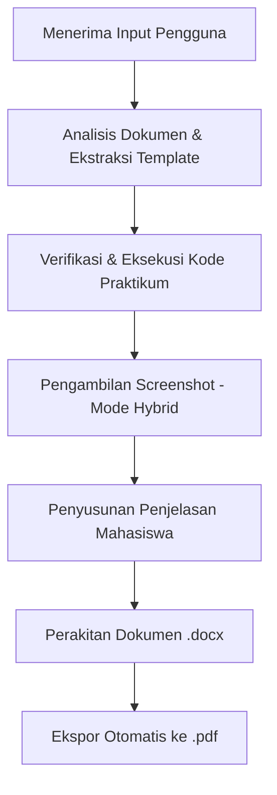

# NgeLaprak: Universal Laboratory Report Generator Skill

Skill ini memandu AI Agent dalam menyusun **Laporan Praktikum (Laprak)** yang rapi, profesional, dan otentik untuk berbagai mata kuliah teknik/informatika (seperti Struktur Data, ADPL, PBO, Basis Data, Pemrograman Web, Sistem Operasi, Jaringan Komputer, dll.).

Output yang dihasilkan adalah berkas **Microsoft Word (`.docx`)** dan **PDF (`.pdf`)** yang siap dikumpulkan.

---

## 1. Alur Kerja Utama (Workflow)



### Langkah 1: Deteksi & Ekstraksi Masukan
Secara cerdas periksa folder atau referensi yang diberikan pengguna:
1. **Modul Praktikum (`Modul*.pdf` / `*.docx`)**:
   - Ekstrak: Judul Pertemuan/Modul, Tujuan Praktikum, Tool yang digunakan, Dasar Teori, dan daftar tugas (Guided, Unguided, Latihan, Tugas Praktikum).
2. **Template atau Contoh Laprak Lama (`*.docx` / `*.pdf`)**:
   - Ekstrak "DNA" laporan:
     - **Cover**: Format judul, logo kampus, format nama mahasiswa, NIM, asisten praktikum, program studi, fakultas, institusi, dan tahun.
     - **Tipografi**: Font (Times New Roman / Arial / Calibri), ukuran judul bab, ukuran isi paragraf.
     - **Margin Halaman**: Atas, bawah, kiri, kanan (misal 4-4-3-3 atau standar 1 inci).
     - **Sistem Penomoran**: Romawi (I. TUJUAN, II. TOOL, III. DASAR TEORI, IV. GUIDED) atau huruf/angka.
3. **Kode Program / Projek Praktikum**:
   - Periksa file kode yang dikerjakan mahasiswa (misal Java Maven/Ant, C++, Python, PHP, dll.).
4. **Tugas Pendahuluan (TP) / Tugas Akhir (Jika Ada)**:
   - Jawab pertanyaan secara singkat, padat, dan akurat.

---

### Langkah 2: Eksekusi & Validasi Kode
Sebelum membuat laporan, pastikan kode berfungsi:
- Kompilasi dan jalankan kode mahasiswa menggunakan tool yang sesuai (`mvn`, `g++`, `python`, `node`, dll.).
- Pastikan tidak ada compile error.
- Tangkap output program (console stdout, GUI window, database output).

---

### Langkah 3: Screenshot Kode & Output (Mode Hybrid)

Gunakan **Mode Hybrid** untuk mendapatkan tangkapan layar yang paling otentik:

1. **Prioritas 1 - Screenshot Manual Mahasiswa**:
   - Periksa apakah mahasiswa telah menaruh screenshot asli mereka di folder (misal `screenshots/`, `assets/`, atau direktori laporan).
   - Jika file screenshot asli tersedia, gunakan file tersebut.

2. **Prioritas 2 - Generator Otomatis IDE Otentik (`ngelaprak.renderers`)**:
   - Jika screenshot manual tidak tersedia, gunakan modul generator bawaan `ngelaprak` yang menghasilkan tampilan **100% menyerupai editor asli** (bukan kartu web palsu dengan border/tab tiruan):
     - **Java / NetBeans (`netbeans_renderer.py`)**:
       - String literal berwarna **hijau** (`#008000`).
       - Field / static member berwarna **ungu/magenta miring** (`#990066`).
       - Highlight baris kursor aktif berwarna **kuning/krem pastel** (`#fff9e6`).
       - Gutter nomor baris dilengkapi ikon lampu petunjuk (*hint bulb*) dan bracket fold.
       - Pemandu batas kolom vertikal berwarna merah muda tipis di kanan.
       - Hasil crop murni pada kanvas editor, tanpa border kartu web.
     - **C / C++ / Code::Blocks (`codeblocks_renderer.py`)**:
       - Font Consolas/Courier monospace khas Code::Blocks.
       - Nomor baris berjarak rapat di gutter abu-abu.
       - Syntax warna: Keywords biru tua, include/preprocessor hijau, strings merah.
     - **Python / Web / VS Code (`vscode_renderer.py`)**:
       - Tema clean VS Code Dark+ atau Light+.
     - **Output Terminal / Console (`terminal_renderer.py`)**:
       - Tampilan console command prompt / PowerShell / MySQL client asli.
     - **Jendela Java Swing Native (`gui_framer.py`)**:
       - Frame jendela Windows 11 dengan ikon cangkir kopi Java 3D asli dan tombol DWM native.

---

### Langkah 4: Gaya Bahasa Penulisan (Human-Like & Anti-AI)

Tuliskan penjelasan kode dan dasar teori dengan aturan berikut:
- **Gaya Bahasa Mahasiswa Santai & Pragmatis**: Singkat, jelas, langsung ke fungsi kode (*to the point*).
- **Hindari Ciri Bahasa AI**:
  - JANGAN gunakan kata-kata klise robotik seperti: *"Kode ini mendemonstrasikan implementasi komprehensif...", "Melalui arsitektur ini, integritas data terjamin...", "Secara elegan menangani..."*.
  - GUNAKAN gaya natural mahasiswa: *"Fungsi ini dipake buat...", "Di kelas ini kita inisialisasi tabel sama textfield...", "Bagian ini buat nangkep klik tombol simpan biar langsung masuk ke database..."*.
  - Sedikit typo atau kosakata informal santai diperbolehkan agar tidak terdeteksi AI checker kampus.

---

### Langkah 5: Perakitan Dokumen Word (`.docx`) & PDF (`.pdf`)

1. **Tata Letak & Spasi Halaman**:
   - Potong kode panjang menjadi irisan ~20–25 baris per gambar agar tidak memicu *page break* yang meninggalkan ruang kosong janggal.
   - Skalakan lebar gambar secara proporsional (`width = Inches(5.2)` sampai `Inches(5.5)`).
   - Pastikan teks penjelasan berada tepat di bawah gambar kode terkait.
2. **Kompilasi Word (`.docx`)**:
   - Bangun file menggunakan `python-docx` dengan menerapkan style, font, dan cover yang identik dengan template awal.
3. **Ekspor PDF Otomatis**:
   - Di Windows: Ekspor langsung melalui Microsoft Word COM Automation (`Word.Application`).
   - Di Linux / macOS: Gunakan LibreOffice headless (`soffice --headless --convert-to pdf`).

---

## 2. Struktur Referensi Berkas Standar

```
<Workspace Folder>/
├── Modul/          <- Modul praktikum dari dosen/asisten (PDF / Word)
├── Laprak/         <- Template contoh laprak lama & tempat hasil .docx/.pdf
│   └── screenshots/ <- (Opsional) Tempat mahasiswa menaruh screenshot manual
└── Code/           <- Projek kode praktikum mahasiswa
```

---

## 3. Perintah CLI Pendukung

Jika paket `ngelaprak` terpasang di sistem, Anda juga dapat menjalankan tool otomatis via terminal:
```bash
# Inisialisasi struktur folder laporan
python -m ngelaprak init

# Analisis modul dan template
python -m ngelaprak analyze --modul ./Modul/Modul-4.pdf --template ./Laprak/Template.docx

# Build dokumen laprak otomatis
python -m ngelaprak build
```
